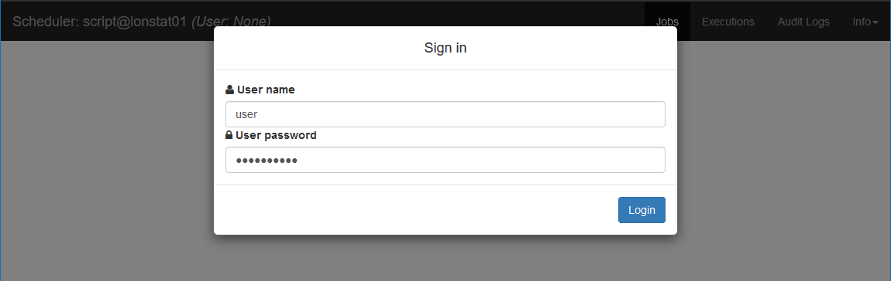
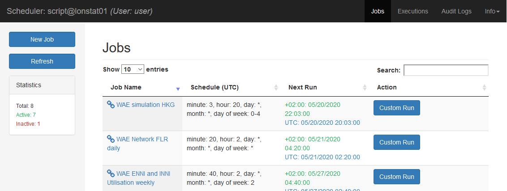
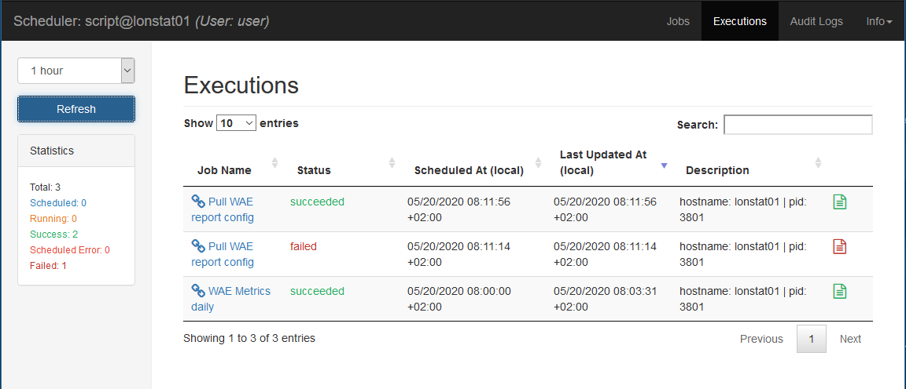
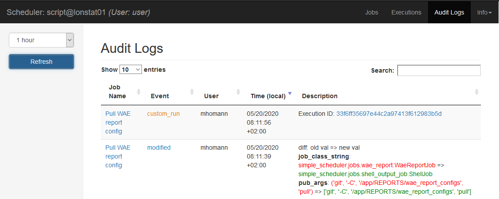
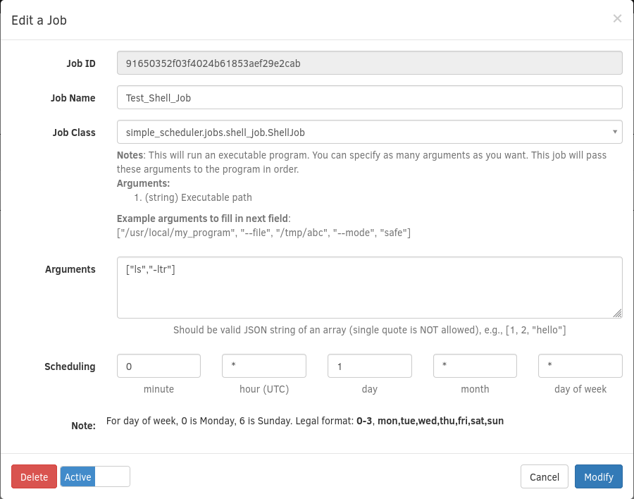

# Nextdoor Scheduler


[](https://travis-ci.org/palto42/ndscheduler)

``ndscheduler`` is a flexible python library for building your own cron-like system to schedule jobs, which is to run a tornado process to serve REST APIs and a web ui.

Check out the blog post - [We Don't Run Cron Jobs at Nextdoor](https://engblog.nextdoor.com/we-don-t-run-cron-jobs-at-nextdoor-6f7f9cc62040#.d2erw1pl6)

**This version of ``ndscheduler`` supports Python 3 on Linux.**

## Table of contents
  
* [Key Abstractions](#key-abstractions)
* [Try it NOW](#try-it-now)
* [How to build Your own cron-replacement](#how-to-build-your-own-cron-replacement)
  * [Install ndscheduler](#install-ndscheduler)
  * [Three things](#three-things)
  * [Reference Implementation](#reference-implementation)
* [Contribute code to ndscheduler](#contribute-code-to-ndscheduler)
* [REST APIs](#rest-apis)
* [Web UI](#web-ui)

## Key Abstractions

* [CoreScheduler](https://github.com/Nextdoor/ndscheduler/tree/master/ndscheduler/corescheduler): encapsulates all core scheduling functionality, and consists of:
  * [Datastore](https://github.com/Nextdoor/ndscheduler/tree/master/ndscheduler/corescheduler/datastore): manages database connections and makes queries; could support Postgres, MySQL, and sqlite.
    * Job: represents a schedule job and decides how to run a particular job.
    * Execution: represents an instance of job execution.
    * AuditLog: logs when and who runs what job.
  * [ScheduleManager](https://github.com/Nextdoor/ndscheduler/blob/master/ndscheduler/corescheduler/scheduler_manager.py): access Datastore to manage jobs, i.e., schedule/modify/delete/pause/resume a job.
* [Server](https://github.com/Nextdoor/ndscheduler/tree/master/ndscheduler/server): a tornado server that runs ScheduleManager and provides REST APIs and serves UI.
* [Web UI](https://github.com/Nextdoor/ndscheduler/tree/master/ndscheduler/static): a single page HTML app; this is a default implementation.

Note: ``corescheduler`` can also be used independently within your own service if you use a different Tornado server / Web UI.

## How to build Your own cron-replacement

### Install ndscheduler

1. Create and activate Python venv under project folder
    * python -m venv .venv
    * source .venv/bin/activate
2. Install with pip
    * pip install -U pip wheel
    * pip install .
    * Install scheduler implementation like `simple_scheduler``
3. Configure ~/.config/ndscheduler/config.yaml
    * See [example configuration](config_example.yaml)
    * Passwords must be hashed with bcrypt
    * See [Python bcrypt tutorial](http://zetcode.com/python/bcrypt/)
    * More ideas for basic_auth [Tornado basic auth example](https://gist.github.com/notsobad/5771635)
4. Start scheduler implementation
5. Launch web browser at configured URL and authenticate with configured account

#### HTTPS support

For https support the script requires the private public key pair.

A self signed certificate can be generated with the command:

```sh
openssl req -x509 -nodes -days 365 -newkey rsa:2048 -keyout ~/.ssl/private/script-selfsigned.key -out ~/.sslssl/certs/script-selfsigned.crt
```

### Three things

You have to implement three things for your scheduler, i.e., ``Settings``, ``Server``, and ``Jobs``.

#### Settings

In your implementation, you need to provide a settings file to override default settings (e.g., [settings in simple_scheduler](https://github.com/Nextdoor/ndscheduler/blob/master/simple_scheduler/settings.py)). You need to specify the python import path in the environment variable ``NDSCHEDULER_SETTINGS_MODULE`` before running the server.

All available settings can be found in [default_settings.py](https://github.com/Nextdoor/ndscheduler/blob/master/ndscheduler/default_settings.py) file.

#### Server

You need to have a server file to import and run ``ndscheduler.server.server.SchedulerServer``.

#### Jobs

Each job should be a standalone class that is a subclass of ``ndscheduler.job.JobBase`` and put the main logic of the job in ``run()`` function.

After you set up ``Settings``, ``Server`` and ``Jobs``, you can run the whole thing like this:

```sh
NDSCHEDULER_SETTINGS_MODULE=simple_scheduler.settings \
PYTHONPATH=.:$(PYTHONPATH) \
    python simple_scheduler/scheduler.py
```

### Upgrading

It is best practice to backup your database before doing any upgrade. ndscheduler relies on [apscheduler](https://apscheduler.readthedocs.io/en/latest/) to serialize jobs to the database, and while it is usually backwards-compatible (i.e. jobs created with an older version of apscheduler will continue to work after upgrading apscheduler) this is not guaranteed, and it is known that downgrading apscheduler can cause issues. See [this PR comment](https://github.com/Nextdoor/ndscheduler/pull/54#issue-262152050) for more details.

### Reference Implementation

See code in the [simple_scheduler/](https://github.com/Nextdoor/ndscheduler/tree/master/simple_scheduler) directory for inspiration :)

Run it

```sh
make simple
```

Access the web ui via [localhost:8888](http://localhost:8888)

The reference implementation also comes with [several sample jobs](https://github.com/Nextdoor/ndscheduler/tree/master/simple_scheduler/jobs).

* AwesomeJob: it just prints out 2 arguments you pass in.
* SlackJob: it sends a slack message periodically, for example, team standup reminder.
* ShellJob: it runs an executable command, for example, run curl to crawl web pages.
* CurlJob: it's like running [curl](http://curl.haxx.se/) periodically.

And it's [dockerized](https://github.com/Nextdoor/ndscheduler/tree/master/simple_scheduler/docker).

## Contribute code to ndscheduler

### Install dependencies

```sh
# Each time we introduce a new dependency in setup.py, you have to run this
make install
```

### Run unit tests

```sh
    make test
```

### Clean everything and start from scratch

```sh
make clean
```

Finally, send pull request. Please make sure the [CI](https://travis-ci.org/Nextdoor/ndscheduler) passes for your PR.

## REST APIs

Please see [README.md in ndscheduler/server/handlers](https://github.com/Nextdoor/ndscheduler/blob/master/ndscheduler/server/handlers/README.md).

## Web UI

We provide a default implementation of web ui. You can replace the default web ui by overwriting these settings

```sh
STATIC_DIR_PATH = :static asset directory paths:
TEMPLATE_DIR_PATH = :template directory path:
APP_INDEX_PAGE = :the file name of the single page app's html:
```

### The default web ui

#### Login



#### List of jobs



#### List of executions



#### Audit Logs



#### Modify a job


